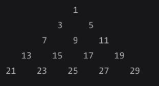

# Row Sum Of Triangle Of Odd Numbers

Given a triangle of consecutive odd numbers:

If given 1, return 1.
If given 2, return the sum of the numbers in the second row, of 3 + 5 => 8.
If given 3, return the sum of the numbers in the third row, of 7 + 9 + 11 => 27.
